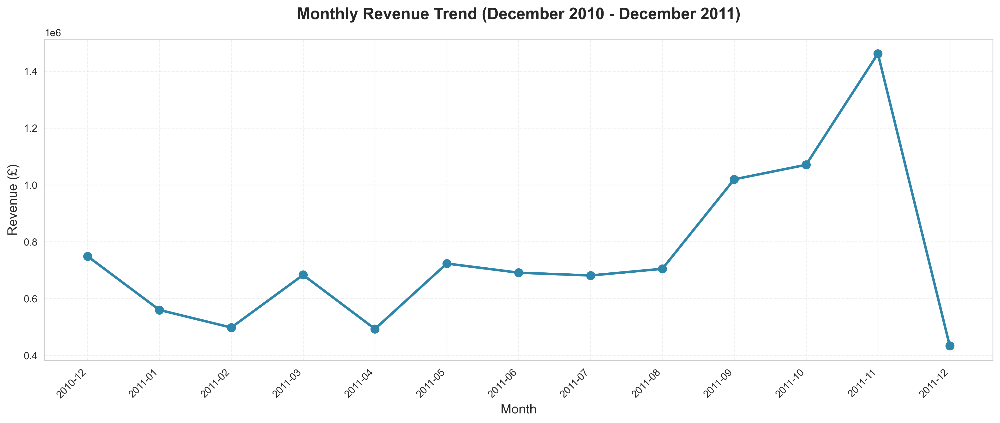
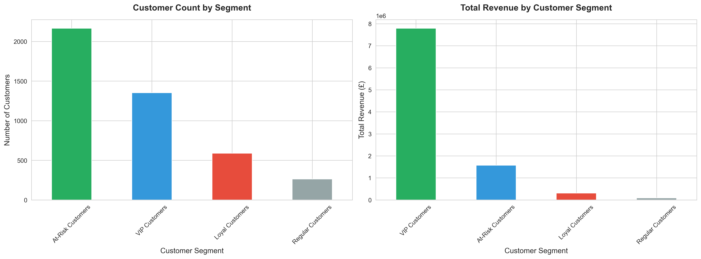
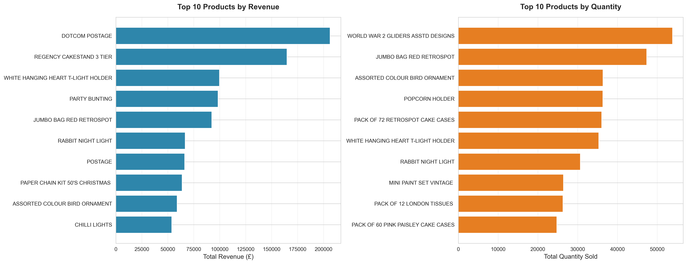

# 📊 E-Commerce Sales Analysis

A comprehensive data analysis project examining UK-based online retail transactions to uncover revenue trends, customer behavior patterns, and product performance insights.


---

## 📋 Table of Contents

- [Project Overview](#Project-overview)
- [Business Questions](#Business-Questions)
- [Dataset](#Dataset)
- [Key Findings](#Key-Findings)
- [Technologies Used](#Technologies-used)
- [Project Structure](#Project-structure)
- [Installation & Usage](#Installation-and-Usage)
- [Visualizations](#Visualizations)
- [Author](#author)

---

## Project-overview

This project analyzes transactional data from a UK-based e-commerce company specializing in unique all-occasion gifts. The analysis spans transactions from **December 2010 to December 2011** and focuses on extracting actionable insights to support strategic business decisions.

**Objective**: Identify revenue patterns, segment customers by value, and evaluate product performance to optimize inventory and marketing strategies.

---

## Business-Questions

This analysis addresses three critical business questions:

### 1. Revenue Performance Analysis
**Question**: What are the monthly revenue trends, and are there seasonal patterns that can inform inventory planning?

**Approach**: Aggregated sales data by month to identify peak and low-performing periods.

### 2. Customer Segmentation (RFM Analysis)
**Question**: Who are our most valuable customers, and how can we segment them to optimize marketing spend?

**Approach**: Applied RFM (Recency, Frequency, Monetary) analysis to classify customers into four segments:
- VIP Customers
- Loyal Customers
- Regular Customers
- At-Risk Customers

### 3. Product Performance Evaluation
**Question**: Which products generate the most revenue, and which underperforming SKUs should be discontinued to reduce holding costs?

**Approach**: Analyzed product-level revenue and transaction volume to identify top performers and low-value inventory.

---

## Dataset

**Source**: [Online Retail Dataset - Kaggle](https://www.kaggle.com/datasets/tunguz/online-retail)

**Description**: Transnational dataset containing all transactions for a UK-based online retail company.

| Column | Description |
|--------|-------------|
| `InvoiceNo` | Unique 6-digit invoice number (starts with 'C' if cancelled) |
| `StockCode` | Unique 5-digit product code |
| `Description` | Product name |
| `Quantity` | Quantity purchased per transaction |
| `InvoiceDate` | Date and time of transaction |
| `UnitPrice` | Product price per unit (£) |
| `CustomerID` | Unique 5-digit customer identifier |
| `Country` | Customer's country of residence |

**Dataset Size**: 541,909 transactions | 8 variables

### Data Files

Due to GitHub file size limitations, the data files are provided in a compressed format:

- **`data.zip`**: Contains both raw and processed datasets
  - `raw/e_commerce.csv` - Original dataset
  - `processed/e_commerce_cleaned.csv` - Cleaned dataset
  - `processed/rfm_customer_segments.csv` - RFM analysis results
  - `processed/product_performance_summary.csv` - Product performance metrics

**To use the data**: Extract `data.zip` in the project root directory before running the notebooks.

---

## Key-Findings

### Revenue Performance
- **Peak Revenue Month**: November 2011 generated the highest revenue
- **Seasonal Pattern**: Clear Q4 surge indicating holiday shopping trends
- **Growth**: Significant year-over-year revenue increase from Dec 2010 to Nov 2011

### Customer Segmentation
- **VIP & Loyal Customers**: Represent ~35% of customer base but contribute **~70% of total revenue**
- **At-Risk Customers**: 1,200+ customers identified for re-engagement campaigns
- **Recommendation**: Implement targeted retention strategies for high-value segments

### Product Performance
- **Top 10 Products**: Account for 15% of total revenue
- **Low Performers**: 450+ SKUs with <5 transactions and minimal revenue
- **Recommendation**: Discontinue underperforming products to optimize inventory costs

---

## Technologies-used

- **Python 3.8+**
- **Pandas** - Data manipulation and analysis
- **NumPy** - Numerical computing
- **Matplotlib & Seaborn** - Data visualization
- **Jupyter Notebook** - Interactive analysis environment

---

## Project-structure
```
E-Commerce-Sales-Analysis/
│
├── data.zip                           # Compressed data files (extract before use)
│   ├── raw/
│   │   └── e_commerce.csv
│   └── processed/
│       ├── e_commerce_cleaned.csv
│       ├── rfm_customer_segments.csv
│       └── product_performance_summary.csv
│
├── notebooks/
│   ├── 01_e_commerce_data_cleaning.ipynb    # Data cleaning and preprocessing
│   └── 02_business_analysis.ipynb           # Business analysis and insights
│
├── images/                            # Visualization outputs
│   ├── monthly_revenue_trend.png
│   ├── customer_segmentation.png
│   └── product_performance.png
│
├── .gitignore
├── requirements.txt
└── README.md
```

---

## Installation-and-Usage

### Prerequisites
- Python 3.8 or higher
- Jupyter Notebook

### Setup Instructions

1. **Clone the repository**
```bash
git clone https://github.com/Bekyee/E-Commerce-Sales-Analysis.git
cd E-Commerce-Sales-Analysis
```

2. **Extract the data files**
```bash
# Windows (using File Explorer)
Right-click on data.zip → Extract All

# Mac/Linux (using terminal)
unzip data.zip
```

3. **Install required packages**
```bash
pip install -r requirements.txt
```

4. **Launch Jupyter Notebook**
```bash
jupyter notebook
```

5. **Run the notebooks in order**
   - Start with `01_e_commerce_data_cleaning.ipynb`
   - Then proceed to `02_business_analysis.ipynb`

---

## Visualizations

### Monthly Revenue Trend


*Monthly revenue shows strong seasonal patterns with peak performance in Q4, indicating significant holiday shopping activity.*

### Customer Segmentation


*RFM analysis reveals that VIP and Loyal customers, while representing only 35% of the customer base, contribute approximately 70% of total revenue.*

### Product Performance


*Product analysis identifies clear revenue concentration among top performers, with the top 10 products accounting for 15% of total revenue.*

---

## Author

**Becky Wu**
- GitHub: [@Bekyee](https://github.com/Bekyee)
- LinkedIn: [Becky Wu](https://www.linkedin.com/in/bekcy-wu-699895398)

*Aspiring Data Analyst with a background in Accounting, passionate about using data to solve business problems and improve financial efficiency.*

---

## Acknowledgments

- Dataset provided by [UCI Machine Learning Repository](https://archive.ics.uci.edu/ml/datasets/online+retail)
- Special thanks to the Kaggle community for making this dataset accessible
- Original dataset collected by Dr. Daqing Chen, Director of Public Analytics group, Chongqing University, China

---

## Contact

For any questions or collaboration opportunities, feel free to reach out via [LinkedIn](https://www.linkedin.com/in/bekcy-wu-699895398) or open an issue in this repository.

---

This project demonstrates proficiency in:
- Data cleaning and preprocessing
- Exploratory data analysis (EDA)
- Customer segmentation using RFM analysis
- Business insights extraction
- Data visualization and storytelling
